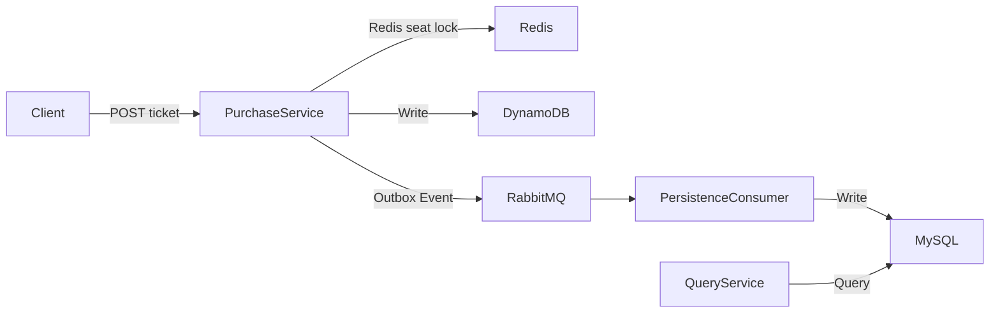

# High-Concurrency-CQRS-Ticketing-Platform

A ticket-purchasing backend designed for high contention and throughput.
It uses CQRS to separate the write path (seat reservation and event emission) from the read path (queries and
analytics).
Redis + Lua performs O(1) atomic seat locks, RabbitMQ decouples user requests from persistence, DynamoDB stores the
write model, and MySQL (via Spring Data JPA) stores the read model.

## Latest Updates

**Latest Updates**

- [DONE] Migrated JDBC → Spring Data JPA (read side / MySQL)
    - Reduced boilerplate, improved transaction handling, and simplified testing.
- [DONE] One-click local bring-up with Docker Compose
    - Spins up Redis, RabbitMQ, MySQL, DynamoDB Local, and all service containers in one command
- [DONE] Unified DynamoDB schema
    - Standardized attribute names/types (e.g., zoneId, createdOn) across producer and consumer, removing schema drift
      errors.
- [DONE] DynamoDB Local with -sharedDb
    - Shared local DB file across regions/accounts to prevent “written but cannot read” issues during multi-service
      testing.

### Architecture Diagram



## Architecture

- ### Structure
    - **Purchase Service (API)**
        - Spring Boot REST controllers (ticket creation)
        - Service layer (Redis/Lua seat lock)
        - Direct DynamoDB writes (write model)
        - Outbox integration and RabbitMQ producer for ticket events
        - **Persistence Consumer Service**
            - RabbitMQ consumer that projects ticket events into MySQL (read model) for queries and analytics.
            - Implements Outbox pattern with Spring Cloud Stream (RabbitMQ binder) for reliable and redoable message
              delivery.
        - **Query Service**
            - Exposes REST APIs for ticket queries, counts, and revenue aggregation.
            - Uses Spring Data JPA to query MySQL read models.
        - **Deployment**
            - Docker Compose brings up Redis, RabbitMQ, MySQL, DynamoDB Local, and all service containers with one
              command.
- ### Route
    - **Write Path**
        - REST API receives the purchase request
            - → Redis Lua atomically checks and locks a seat
            - → Writes ticket data to DynamoDB (write model)
            - → Writes an event to the Outbox table
            - → Spring Cloud Stream (RabbitMQ binder) publishes Outbox event to RabbitMQ
    - **Consumers (Projectors)**
        - RabbitMQ consumer subscribes to ticket events
            - → Projects ticket data into MySQL (read model)
            - → MySQL read model supports queries, counts, and analytics

## Run Locally

- `./mvnw clean package`
    - run in ticketing and RabbitConsumer project
- `./localDockerInitiate.sh`
- `docker-compose down`

## REST API

### Purchase API (Write Path)

- `POST /api/v1/tickets`
    - Request Body:
      ```json
      {
        "venueId": "Venue1",
        "eventId": "Event1",
        "zoneId": 2,
        "row": "10",
        "column": "b"
      }
      ```
    - Response (201 Created):
      ```json
          {
          "ticketId": "UUID",
          "zoneId": 2,
          "row": "b",
          "column": "10",
          "createdOn": "time stamp"
          }
      ```

### Query API (Read Path)

- `GET /api/v1/tickets/{ticketId}`
    - Response:
      ```json
      {
      "ticketId": "UUID",
      "venueId": "Venue1",
      "eventId": "Event1",
      "zoneId": 2,
      "row": "10",
      "column": "b",
      "status": "PAID",
      "createdOn": "time stamp"
      }
      ```
        - Error:  404 Not Found if ticket does not exist.

- `GET /api/v1/tickets/count/{eventId}`
    - Returns how many tickets sold per zone.
      ```json
      {
      "eventId": "Event1",
      "zones": [
          { "zoneId": 1, "soldCount": 120 },
          { "zoneId": 2, "soldCount": 300 }
      ]
      }
      ```

- `GET /api/v1/tickets/money/{venueId}/{eventId}"`
    - Response:
        ```JSON
        {
        "eventId": "Event1",
        "ticketPrice": 120.0
        }
        ```

## TODO
- Ticket select Area front end & Front end management service
- Update RabbitMQ to Kafka, better concurrency and persistent support
- Shopping Cart & Ticket Hold
  - Hold space for consumer while making payment
  - Payment verification
  - Undo Purchase, undo seat purchase, release seat hold.