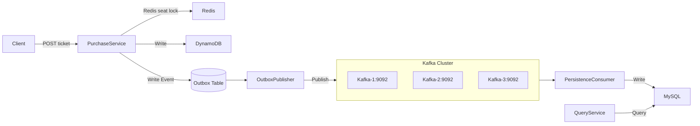

# High-Concurrency-CQRS-Ticketing-Platform

A ticket-purchasing backend designed for high contention and throughput.
It uses CQRS to separate the write path (seat reservation and event emission) from the read path (queries and
analytics).
Redis + Lua performs O(1) atomic seat locks, RabbitMQ decouples user requests from persistence, DynamoDB stores the
write model, and MySQL (via Spring Data JPA) stores the read model.

## Latest Updates

**Latest Updates**

- [DONE] Migrated read-side queries from JDBC to Spring Data JPA (MySQL)
    - Reduced boilerplate code and improved transaction handling for complex queries
    - Kept high-performance JDBC for speed critical writes
- [DONE] Added Kafka to replace RabbitMQ for message streaming
    - Better concurrency support and persistent message handling
- [DONE] Modular deployment system with secure environment management
- [DONE] One-click local deployment with Docker Compose
    - Spin up Redis, Kafka, MySQL, DynamoDB Local, and all microservices in one command
- [DONE] Unified DynamoDB schema with -sharedDb for multi-service testing

## TODO

- **Virtual Thread Integration**: Multi-threaded purchase and Kafka consumer processing optimization
- **Search Page**: Event search and filtering functionality  
- **Login System**: User authentication with JWT
- **Shopping Cart**: Temporary seat hold with payment verification
- **Frontend Management**: Ticket selection area and admin interface

### Architecture Diagram



## Architecture

- ### Structure
    - **Purchase Service (Write API)**
      - Spring Boot REST controllers (ticket creation)
      - Service layer (Redis + Lua for atomic seat lock)
      - Direct writes to **DynamoDB** (write model / source of truth)
      - **Outbox pattern implemented here:**
          - Write ticket events into **OutboxEvent** table (DynamoDB)
          - `OutboxPublisher` reads unsent events, applies retry & dead-letter logic
          - Publishes events to **RabbitMQ** (via Spring Cloud Stream / Rabbit binder)
      
    - **Persistence Consumer Service (Read Model Projector)**
      - Spring Boot service consuming ticket events from **RabbitMQ**
      - Persists events into **MySQL** (read-optimized model)
      - Uses Outbox + retry + dead-letter handling for reliable, idempotent projection

    - **Query Service (Read API)**
        - Exposes REST APIs for:
            - Fetching a ticket by `ticketId`
            - Counting sold tickets per event/zone
            - Aggregating ticket revenue
        - Uses **Spring Data JPA** to query the MySQL read model

- ### Route
    - **Write Path**
        - REST API receives the purchase request
            - → Redis Lua atomically checks and locks a seat
            - → Writes ticket data to DynamoDB (write model)
            - → Writes an event to the Outbox table
            - → Spring Cloud Stream (RabbitMQ binder) publishes Outbox event to RabbitMQ
    - **Consumers (Projectors)**
        - RabbitMQ consumer subscribes to ticket events
            - → Projects ticket data into MySQL (read model)
            - → MySQL read model supports queries, counts, and analytics

## Run Locally

### Quick Start
```bash
# One-click deployment (builds and starts all services)
./localDockerInitiate.sh

# Optional: specify environment and quiet mode
./localDockerInitiate.sh --env local --quiet

# Stop all services
docker compose -f deployment/docker-compose.yml down
```

### Environment Setup
- Copy `deployment/.env.template` to create `deployment/.env.personal`
- Update credentials in `.env.personal` (ignored by git)
- Kafka cluster ID is auto-generated by build script

### Access Points
- **Kafka UI**: http://localhost:8088
- **Purchase Service**: http://localhost:8080
- **Query Service**: http://localhost:8081

## REST API

### Purchase API (Write Path)

- `POST /api/v1/tickets`
    - Request Body:
      ```json
      {
        "venueId": "Venue1",
        "eventId": "Event1",
        "zoneId": 2,
        "row": "10",
        "column": "b"
      }
      ```
    - Response (201 Created):
      ```json
          {
          "ticketId": "UUID",
          "zoneId": 2,
          "row": "b",
          "column": "10",
          "createdOn": "time stamp"
          }
      ```

### Query API (Read Path)

- `GET /api/v1/tickets/{ticketId}`
    - Response:
      ```json
      {
      "ticketId": "UUID",
      "venueId": "Venue1",
      "eventId": "Event1",
      "zoneId": 2,
      "row": "10",
      "column": "b",
      "status": "PAID",
      "createdOn": "time stamp"
      }
      ```
        - Error:  404 Not Found if ticket does not exist.

- `GET /api/v1/tickets/count/{eventId}`
    - Returns how many tickets sold per zone.
      ```json
      {
      "eventId": "Event1",
      "zones": [
          { "zoneId": 1, "soldCount": 120 },
          { "zoneId": 2, "soldCount": 300 }
      ]
      }
      ```

- `GET /api/v1/tickets/money/{venueId}/{eventId}"`
    - Response:
        ```JSON
        {
        "eventId": "Event1",
        "ticketPrice": 120.0
        }
        ```

